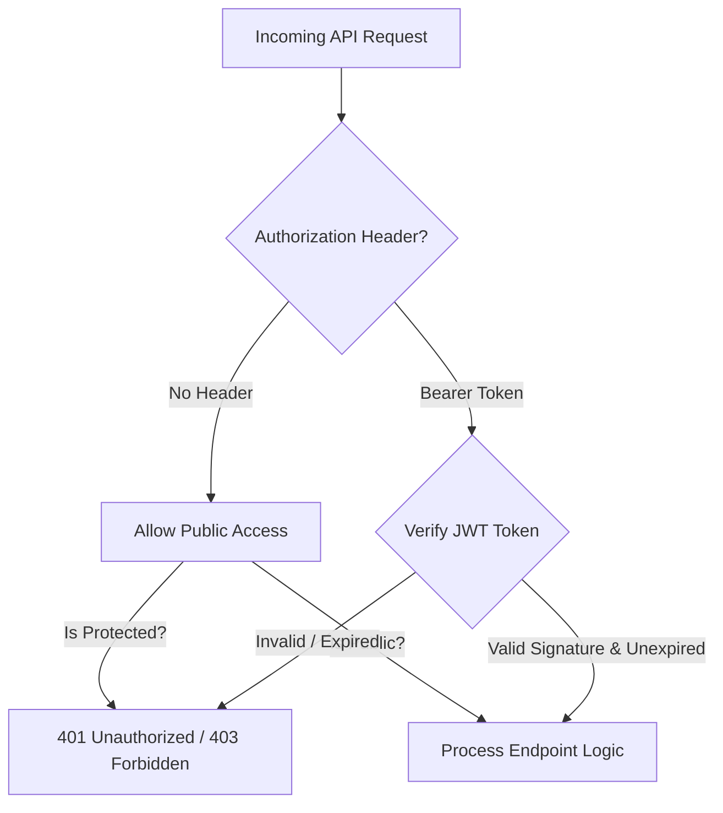

# RARE NUTS — API Security & Authentication Matrix

This document maps all API endpoints to their authentication type, token transport headers, and verification keys.

---

## 1. Authentication Layer Controls

---

## 2. API Endpoint Verification Details

| Endpoint Pattern | Method | Auth Protocol | Verification Key | Verification Header | Fallback / Security Control |
| :--- | :--- | :--- | :--- | :--- | :--- |
| `/auth/register` | `POST` | `None` | N/A | N/A | DTO input validation. |
| `/auth/login` | `POST` | `None` | N/A | N/A | Credential comparison, bcrypt validation. |
| `/auth/refresh` | `POST` | `None` | `JWT_REFRESH_SECRET` | Payload request body | Validates refresh token signature, rotates tokens. |
| `/auth/forgot-password` | `POST` | `None` | N/A | N/A | Single-use expiring token payload email. |
| `/auth/reset-password` | `POST` | `None` | Reset Token hash | Payload request body | Single-use lookup validation. |
| `/users/me/*` | `ANY` | `JWT` | `JWT_SECRET` | `Authorization: Bearer <JWT>` | Resolves user profile from token payload context. |
| `/products` | `GET` | `None` | N/A | N/A | Static reading. |
| `/products/:slug` | `GET` | `None` | N/A | N/A | Static reading. |
| `/cart` | `GET` | `Optional JWT` | `JWT_SECRET` | `Authorization: Bearer <JWT>` | Returns user profile cart or guest `cartId` fallback. |
| `/cart/items` | `POST` | `Optional JWT` | `JWT_SECRET` | `Authorization: Bearer <JWT>` | Maps item changes. Enforces positive integers. |
| `/cart/merge` | `POST` | `JWT` | `JWT_SECRET` | `Authorization: Bearer <JWT>` | Integrates guest sessions into caller profiles. |
| `/orders` | `POST` | `Optional JWT` | `JWT_SECRET` | `Authorization: Bearer <JWT>` | Client idempotency verification. Throttles IP rate limits. |
| `/orders/me` | `GET` | `JWT` | `JWT_SECRET` | `Authorization: Bearer <JWT>` | Filters profile orders. |
| `/orders/:id` | `GET` | `JWT` | `JWT_SECRET` | `Authorization: Bearer <JWT>` | Checks order ownership. |
| `/orders/:id/cancel` | `DELETE` | `JWT` | `JWT_SECRET` | `Authorization: Bearer <JWT>` | Enforces status transitions and updates inventory logs. |
| `/wishlists/*` | `ANY` | `JWT` | `JWT_SECRET` | `Authorization: Bearer <JWT>` | Updates user profile wishlist. |
| `/reviews` | `POST` | `JWT` | `JWT_SECRET` | `Authorization: Bearer <JWT>` | Creates reviews. Default status is approved. |
| `/reviews/user/:userId`| `GET` | `JWT` | `JWT_SECRET` | `Authorization: Bearer <JWT>` | Confirms caller matches target `userId` context. |
| `/payments/verify` | `POST` | `None / Signature`| `RARE_NUTS_KEY_SECRET` | Request Payload | Signature hash comparison. |
| `/payments/webhook` | `POST` | `Signature` | `RARE_NUTS_WEBHOOK_SECRET` | `x-razorpay-signature` | Cryptographic signature verification. |
| `/admin/*` | `ANY` | `JWT` | `JWT_SECRET` | `Authorization: Bearer <JWT>` | Admin status check and RBAC role validation. |
