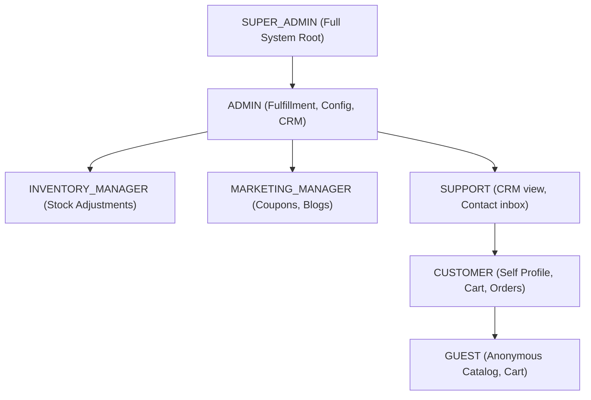

# RARE NUTS — Master Authorization & RBAC Matrix

This document maps all sensitive system access pathways, defining role hierarchies and zero-trust IDOR checks.

---

## 1. Role Hierarchy Map

---

## 2. API Authorization Matrices

### 2.1 Customer Scopes
| Operation | Required Role | IDOR Prevention Check |
| :--- | :--- | :--- |
| **View Profile** | `customer` / `admin` | Fetches details using `@GetUser().id`. No URL parameters accepted. |
| **Update Profile** | `customer` / `admin` | Updates details using `@GetUser().id`. |
| **Change Password** | `customer` / `admin` | Validates hash against `@GetUser().id`. |
| **Manage Addresses** | `customer` / `admin` | Restricts operations to `Address.userId === @GetUser().id` and `orders: { none: {} }`. |
| **Fetch Cart** | `guest` / `customer` | If JWT presents, locks query to `Cart.userId === user.id`. |
| **Manage Cart Items**| `guest` / `customer` | Checks if target `CartItem.cart.userId === user.id` to prevent modifications to other users' carts. |
| **Place Order** | `guest` / `customer` | Automatically overrides `userId` payload parameter with token context if authenticated. |
| **View Orders List**| `customer` | Restricts queries to `Order.userId === user.id`. |
| **View Order Details**| `customer` | Enforces `Order.userId === user.id` in `OrdersService.getOrderById`. |
| **Cancel Order** | `customer` | Verifies `Order.userId === user.id` and validates status is not shipped/delivered. |
| **Read Reviews History**| `customer` | Verifies target `userId` in parameters matches `@GetUser().id` context. |

### 2.2 Admin Scopes
| Operation | SUPER_ADMIN | ADMIN | INVENTORY_MANAGER | MARKETING_MANAGER | SUPPORT |
| :--- | :---: | :---: | :---: | :---: | :---: |
| **Configure System Parameters** | 🟢 | 🔴 | 🔴 | 🔴 | 🔴 |
| **View Audit Logs** | 🟢 | 🔴 | 🔴 | 🔴 | 🔴 |
| **Update CRM Customer Status** | 🟢 | 🟢 | 🔴 | 🔴 | 🔴 |
| **Moderate Reviews** | 🟢 | 🟢 | 🔴 | 🔴 | 🟢 |
| **Update Order Status / Payment**| 🟢 | 🟢 | 🔴 | 🔴 | 🔴 |
| **Create / Adjust Product Details**| 🟢 | 🟢 | 🟢 | 🔴 | 🔴 |
| **Manage Promos & Coupons** | 🟢 | 🟢 | 🔴 | 🟢 | 🔴 |
| **Create Blog Posts** | 🟢 | 🟢 | 🔴 | 🟢 | 🔴 |
| **View Storefront Metrics** | 🟢 | 🟢 | 🔴 | 🟢 | 🔴 |
| **Read Support Tickets / Contact** | 🟢 | 🟢 | 🔴 | 🔴 | 🟢 |
