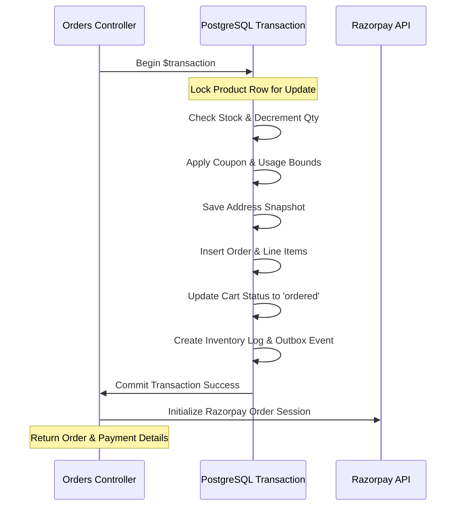

# RARE NUTS — Data Integrity & Database Reliability Audit

This document reviews the database schema constraints, unique keys, transaction rollbacks, and financial precision settings of the RARE NUTS platform.

---

## 1. Relational Integrity and Constraints

The system uses Prisma ORM to map PostgreSQL database constraints. Key relationships are reviewed below:

### 1.1 Deletion & Cascading Behaviors
- **`Address` vs `Order`:**
  - `Address` is linked to `Order` via `AddressId`.
  - When an address has been used to ship an order, it must not be modified or deleted. 
  - To enforce this, `UsersService` only retrieves or modifies addresses where `orders: { none: {} }` ([users.service.ts:L82](file:///c:/Users/adts-/Desktop/almonds/auremont-backend/src/users/users.service.ts#L82)). 
  - Once an address is used in an order, it becomes a permanent record. To update their delivery details, customers must create a new address record. This prevents historical orders from being orphaned or updated retroactively.
- **`User` vs `Order`:**
  - Customer accounts hold historical orders.
  - Deleting a user with existing orders is restricted by the database foreign key constraint, preventing accidental data loss of financial transactions.

### 1.2 Unique Constraints & Indexes
- **Cart Concurrency:**
  - `CartItem` features a `@@unique([cartId, productId])` constraint.
  - If a user sends concurrent requests to add the same product to their cart, this database-level constraint prevents duplicate rows. Instead, the server updates the existing quantity, maintaining data integrity.
- **Idempotency Safeguard:**
  - `Order` features a `@@unique([idempotencyKey])` index.
  - Duplicate API requests using the same checkout key are rejected by the database, preventing double charges.
- **Query Performance Indexes:**
  - Indexes are placed on key query paths to improve lookups:
    - `Product` indexes: `categoryId`, `collectionId`, `status`, and `createdAt` keys.
    - `Order` indexes: `userId`, `createdAt`, and `orderStatus` keys.

---

## 2. Order Placement Transaction Reliability

Order creation is executed within an atomic database transaction using Prisma's `$transaction` query manager ([orders.service.ts:L101](file:///c:/Users/adts-/Desktop/almonds/auremont-backend/src/orders/orders.service.ts#L101)).

### 2.1 Transaction Failure Scenarios
1. **Stock Depletion:**
   - If stock is insufficient for any item in the cart, the transaction throws a `ConflictException` and rolls back. Product inventory levels, coupon usage, and addresses remain unchanged.
2. **Database Failure or Timeout:**
   - If a database query fails or times out, the transaction rolls back completely. This prevents partial orders from being created.
3. **Razorpay Failure:**
   - The Razorpay session is initialized *after* the database transaction commits successfully. If the Razorpay API is down, the order is still created in a `pending` state, allowing the customer to retry the payment later without losing their cart structure.

---

## 3. Financial Precision

Monetary values are processed using Prisma's `Decimal` type, which maps to PostgreSQL's `numeric(10,2)` field. This prevents floating-point rounding errors common in JavaScript.

$$\text{Total} = \text{Subtotal} + \text{Tax} + \text{Shipping} - \text{Discount}$$

### 3.1 Verification Rules
- The server reconstructs the checkout amount by querying the database for product prices. It ignores any financial values sent in the client payload.
- Percentage discounts are calculated using `subtotal.mul(coupon.value).div(100)` and capped at `coupon.maxDiscount` using server-side decimal math.
- Invoices are generated based on these verified database values.
