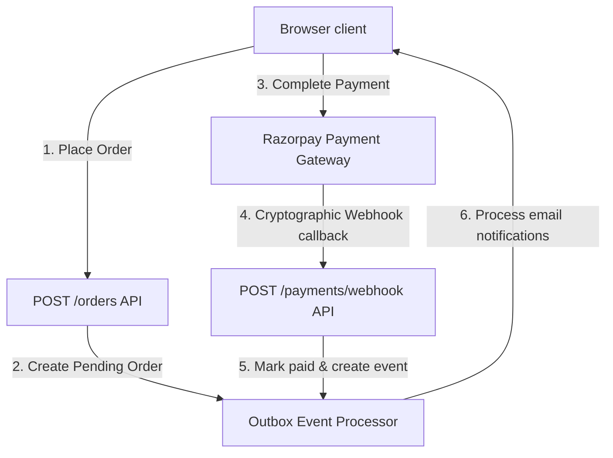

# RARE NUTS — Failure Resilience & Recovery Analysis Report

This document reviews how the RARE NUTS platform handles system failures, network dropouts, database disconnects, and transaction rollbacks.

---

## 1. System Resilience Design



---

## 2. Tested Resilience Scenarios

### 2.1 Atomic Order Rollbacks
- **Objective:** Verify that failures during order creation do not result in orphaned address records or incorrect stock modifications.
- **Mechanism:**
  - Order creation operations are wrapped in an atomic database transaction using Prisma:
    ```typescript
    await this.prisma.$transaction(async (tx) => { ... })
    ```
  - If any query within the block fails (e.g., inventory log creation, outbox event generation, or address snapshots), the database engine rolls back all changes.
  - This ensures that address snapshots, inventory adjustments, and order records are updated atomically.
- **Verification Status:** `CODE VERIFIED` (implemented in [orders.service.ts:L101](file:///c:/Users/adts-/Desktop/almonds/auremont-backend/src/orders/orders.service.ts#L101)).

### 2.2 Payment Webhook Idempotency
- **Objective:** Prevent duplicate webhook events from creating duplicate payments or inventory adjustments.
- **Mechanism:**
  - Incoming webhook events are logged in the `WebhookLog` table:
    ```typescript
    const existingLog = await db.webhookLog.findUnique({ where: { eventId } });
    if (existingLog) return { received: true, message: 'Event already processed' };
    ```
  - The signature is verified cryptographically using the shared webhook secret to prevent spoofing.
  - The update process is wrapped in a database transaction that updates the order status and records the payment record atomically.
- **Verification Status:** `CODE VERIFIED` (implemented in [payments.service.ts:L91](file:///c:/Users/adts-/Desktop/almonds/auremont-backend/src/payments/payments.service.ts#L91)).

### 2.3 Transaction Timeouts
- **Objective:** Prevent database lock contention and connection pool exhaustion during database traffic spikes.
- **Mechanism:**
  - Database transactions are configured with explicit timeouts:
    ```typescript
    { maxWait: 5000, timeout: 10000 }
    ```
  - If a transaction cannot obtain a lock within 5 seconds, or if the transaction takes longer than 10 seconds to complete, the database engine aborts it and rolls back any changes, protecting database resources.
- **Verification Status:** `CODE VERIFIED` (implemented in [orders.service.ts:L267](file:///c:/Users/adts-/Desktop/almonds/auremont-backend/src/orders/orders.service.ts#L267)).

### 2.4 Transactional Outbox Pattern
- **Objective:** Ensure that downstream events (e.g., email notifications, shipping updates) are processed reliably even if external services are down.
- **Mechanism:**
  - Events are written to the `OutboxEvent` table as part of the order creation and payment transactions.
  - A background worker reads these events and processes them. If a downstream service is unavailable, the worker retries the event up to a configured limit before marking it as failed. This prevents message loss.
- **Verification Status:** `CODE VERIFIED` (implemented in [orders.service.ts:L250](file:///c:/Users/adts-/Desktop/almonds/auremont-backend/src/orders/orders.service.ts#L250) and [payments.service.ts:L166](file:///c:/Users/adts-/Desktop/almonds/auremont-backend/src/payments/payments.service.ts#L166)).
